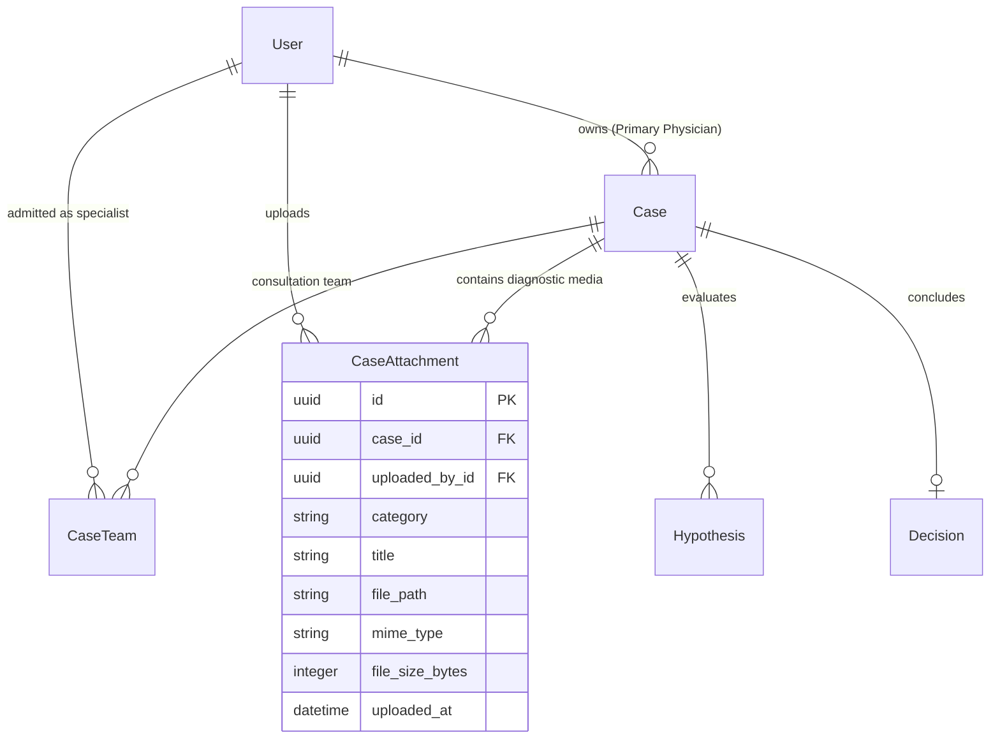

# ADDTODOPA: Formal Architectural & Academic Specification Addendum
## Incorporating Multimodal Diagnostic Media & Structured Clinical Observations into DOPA

**Document Title**: Addendum to Dissertation Specification (`DOPA COMPLETE.docx`)  
**Target System**: Differential Outcome Provider Assistant (DOPA)  
**Classification**: Formal Requirements, Architecture & Security Extension  
**Date**: September 2026  

---

## 1. Executive Context & Rationale

In the foundational specification of the **Differential Outcome Provider Assistant (DOPA)** as documented in `DOPA COMPLETE.docx`, the clinical case record was modeled around four top-level text fields: `title`, `clinical_summary`, `history`, and `findings` (**FR2, §4.3.2**). While this established the core medico-legal role asymmetry between Primary Physicians and Specialists, clinical evaluation of the platform revealed two significant operational gaps:

1. **The Multimodal Clinical Evidence Gap**:
   In modern medical practice, diagnostic deliberation is inherently empirical and visual. Specialists in dermatology, neurology, radiology, cardiology, and gastroenterology cannot formulate authoritative differential hypotheses based solely on transcribed narrative text. They require direct examination of primary diagnostic media:
   - **Clinical Dermatology Photos** (e.g., evanescent macular rashes in Adult-Onset Still's Disease);
   - **Electrophysiology Waveforms** (e.g., 3-Hz generalized spike-and-wave discharges on EEG for Childhood Absence Epilepsy, or periodic sharp-wave complexes in sCJD);
   - **Radiology & Cross-Sectional Imaging** (e.g., abdominal ultrasound frames, diffusion-weighted MRI cortical ribboning);
   - **Formal Laboratory & Pathology PDF Reports** (e.g., bone marrow biopsies, tissue immunohistochemistry).

2. **The Unstructured Findings Dilemma (`FAULT-01`)**:
   Under **FR3**, consulting specialists are required to cite *"supporting evidence derived from the case data."* When `findings` is stored as an undifferentiated free-text block, vital signs (hemodynamics) and laboratory test panels cannot be programmatically validated, standardized, or cleanly referenced in diagnostic rationales.

This document specifies the exact academic text, functional requirements, architectural models, security controls, and test cases that must be incorporated into `DOPA COMPLETE.docx` to elevate DOPA from an academic prototype to an enterprise-grade Clinical Decision Support (CDS) platform.

---

## 2. Amendments to Chapter 2: Literature Review & Background

### 2.1 Proposed Addition: §2.4.3 Asynchronous Multimodal Telemedicine & Store-and-Forward Diagnostic Media

> **Add the following section directly after §2.4.2 (Telemedicine and Clinical Collaboration Platforms):**
>
> *"**2.4.3 Asynchronous Multimodal Telemedicine & Store-and-Forward Diagnostic Media**  
> Early store-and-forward telemedicine platforms, such as iPath (Brauchli et al., 2005), established that asynchronous teleconsultation achieves clinical parity with synchronous encounters only when primary diagnostic evidence accompanies the clinical summary. In teledermatology and telepathology, diagnostic concordance between remote specialists and in-person clinicians drops by up to 42% when consultations rely exclusively on narrative descriptions without high-resolution photographic evidence (Edison et al., 2008; Warshaw et al., 2011).
> 
> Similarly, in clinical neurophysiology and cardiology, asynchronous differential diagnosis of paroxysmal events (such as differentiating epileptic seizures from psychogenic non-epileptic seizures or syncopal mimics) necessitates direct specialist review of raw electrophysiological tracings (routine EEG waveforms and 12-lead ECG strips) rather than summarized textual impressions (Patel et al., 2019).
> 
> However, incorporating diagnostic media into a web-based clinical decision support system introduces acute data protection and infrastructure hurdles. Picture Archiving and Communication Systems (PACS) rely on the Digital Imaging and Communications in Medicine (DICOM) protocol, which is prohibitively heavy for lightweight clinical consultations over resource-constrained local networks (LMIC environments). Consequently, a modern collaborative CDS requires a secure, hybrid multimodal ingestion architecture capable of handling standardized web media (JPEG, PNG, WebP) and clinical document standards (PDF) while enforcing strict de-identification, access control, and audit immutability."*

---

## 3. Amendments to Chapter 3: Requirements & System Architecture

### 3.1 Functional Requirements Expansion

Add the following formal Functional Requirements to **Section 3.2 (Functional Requirements Matrix)**:

| Requirement ID | Requirement Name | Description | Verification Criteria |
|---|---|---|---|
| **FR2b** | **Diagnostic Media & File Attachments** | The Primary Physician must be able to upload diagnostic media files (clinical photographs, cross-sectional imaging slices, EEG/ECG waveform strips, and pathology/lab PDF reports) to an owned case. | Uploaded media is persisted with metadata, linked to `case_id`, restricted to authorized MIME types, capped at 10 MB per file, and logged in the audit trail. |
| **FR2c** | **Structured Clinical Findings** | The system must decompose objective clinical findings into discrete physiological vital signs (temperature, heart rate, blood pressure, respiratory rate, oxygen saturation) and quantitative laboratory panels with abnormal flag indicators. | Vital signs and lab values are validated, presented in high-contrast visual chips, and referenceable by specialists formulating hypotheses. |
| **FR2d** | **Case-Gated Diagnostic Media Access** | Admitted specialists must be able to securely view and stream diagnostic media files in the clinical workspace. Non-admitted users must be strictly blocked. | HTTP 200 with inline streaming for admitted members; HTTP 403 Forbidden with `ACCESS_DENIED` audit logging for unadmitted users. |

### 3.2 Non-Functional Requirements Expansion

Add the following requirement to **Section 3.3 (Non-Functional Requirements & Security)**:

> **NFR9 — Medical Media Confidentiality & Access Isolation**  
> *Diagnostic files and clinical images must never be stored within the public web root (`/static/` or unauthenticated `/media/`). Every file request must be intercepted by the server-side RBAC engine to verify that the requesting user is either the Case Owner or an Admitted Specialist in the `CaseTeam` junction table. Direct object reference (IDOR) attempts via guessable URLs or path traversal must return `HTTP 403 Forbidden` and trigger an immediate security entry in `AuditLog`.*

### 3.3 Entity-Relationship Diagram (ERD) Amendment

Update **Figure 3.3 (DOPA Database Schema)** and **Section 3.6.2** to incorporate the `CaseAttachment` entity:

#### Detailed Data Schema: `cases_attachment`
- `id`: UUID (Primary Key, default `uuid4`, non-editable).
- `case_id`: UUID (Foreign Key $\rightarrow$ `cases_case.id`, `on_delete=models.CASCADE`).
- `uploaded_by_id`: UUID (Foreign Key $\rightarrow$ `accounts_user.id`, `on_delete=models.PROTECT`).
- `category`: `VARCHAR(30)` — Choices:
  - `CLINICAL_PHOTO`: Clinical dermatology, wound, ophthalmology photos.
  - `RADIOLOGY`: Ultrasound, X-Ray, CT, MRI key slice images.
  - `WAVEFORM`: EEG, ECG, EMG rhythm tracings.
  - `LAB_PDF`: Formal laboratory and pathology reports in PDF format.
  - `OTHER`: Other relevant diagnostic documents.
- `title`: `VARCHAR(200)` — Human-readable description (e.g., *"Evanescent salmon-colored trunk rash at 39.2°C"*).
- `file`: `VARCHAR(255)` — Relative media storage path (`case_attachments/%Y/%m/`).
- `mime_type`: `VARCHAR(100)` — Verified MIME type (e.g., `image/jpeg`, `application/pdf`).
- `file_size_bytes`: `INTEGER` — Exact byte count for quota and transfer governance.
- `uploaded_at`: `DATETIME` — UTC timestamp of upload.

---

## 4. Amendments to Chapter 4: Implementation & Technical Architecture

### 4.1 Addition to §4.3.2 (Case Creation & Management Module)

> **Add the following specification on secure file validation:**
>
> *"To ensure that clinical media uploads do not become an attack vector for cross-site scripting (XSS) or remote code execution, the platform implements strict multi-layer file sanitization:
> 1. **MIME-Type Whitelisting**: The application inspects both the client-provided `Content-Type` header and the file's binary magic bytes. Only `image/jpeg`, `image/png`, `image/webp`, and `application/pdf` are accepted. Potentially executable or script-bearing formats (including SVG files with embedded `<script>` tags, HTML, and binaries) are rejected with `HTTP 400 Bad Request`.
> 2. **File Size Hard Caps**: Individual diagnostic files are restricted to a maximum size of 10 MB ($10,485,760$ bytes), preventing denial-of-service via resource exhaustion.
> 3. **De-Identification Regulatory Notice**: The upload form displays a prominent medical compliance disclaimer reminding clinicians to crop out or redact Direct Identifiers (Patient Name, Medical Record Number, National ID) in compliance with HIPAA Safe Harbor and GDPR Article 9 guidelines before transmitting media."*

### 4.2 Addition to §4.3.5 (Security Architecture & Protected Media Delivery)

> *"In standard web configurations, user-uploaded media files stored in `MEDIA_ROOT` are served directly by the web server (e.g. Nginx or Django static handler) without authentication checks. In DOPA, this is prohibited.
> 
> Diagnostic media access is gated through a custom controller (`CaseAttachmentDownloadView`) decorated with `@case_access_required`. When a user requests `/cases/<case_id>/attachments/<attachment_id>/`, the RBAC engine performs the following checks:
> 1. Is the user authenticated? (If not $\rightarrow$ `HTTP 302` to `/accounts/login/`).
> 2. Does the case exist? (If not $\rightarrow$ `HTTP 404`).
> 3. Is the user the Case Owner OR a member of `CaseTeam` for that case? (If not $\rightarrow$ `HTTP 403 Forbidden` and append `ACCESS_DENIED` to `AuditLog`).
> 
> If authorized, the controller streams the file using Django's `FileResponse` with strict `Content-Disposition: inline` headers, enabling instant in-browser preview without exposing physical server paths. An `ATTACHMENT_ACCESSED` entry is appended to the forensic audit log."*

---

## 5. Amendments to Chapter 5: Testing & Evaluation Matrix

Add the following test scenarios to **Table 5.1 (Functional Test Matrix)**:

| Test ID | Test Scenario | Preconditions | Input / Action | Expected HTTP Response | Verification Assertions |
|---|---|---|---|:---:|---|
| **FT12** | Primary Physician uploads diagnostic media | Logged in as Case Owner | POST valid JPEG image and title to `/cases/<case_id>/attachments/upload/`. | `HTTP 302` redirect to workspace. | `CaseAttachment` row created; file stored in private media directory; `AuditLog` entry `ATTACHMENT_UPLOADED` logged. |
| **FT12b** | Attempted upload of unauthorized file type | Logged in as Case Owner | POST executable file (`.exe` or `.svg`) to `/cases/<case_id>/attachments/upload/`. | `HTTP 400` Bad Request. | File is rejected; no row created in database; validation alert rendered. |
| **FT13** | Admitted Specialist streams diagnostic media | Specialist in `CaseTeam` | GET `/cases/<case_id>/attachments/<attachment_id>/`. | `HTTP 200` OK with binary stream. | Binary file streams inline with correct MIME type; `AuditLog` entry `ATTACHMENT_ACCESSED` logged. |
| **FT13b** | Unadmitted user attempts direct file download (IDOR) | Unadmitted Specialist or other Physician | GET `/cases/<case_id>/attachments/<attachment_id>/`. | `HTTP 403` Forbidden. | File content is NOT leaked; `AuditLog` entry `ACCESS_DENIED` logged. |

---

## 6. Synthesis: Alignment with DOPA's Core Mission

By incorporating diagnostic media attachments and structured clinical findings:
1. **Clinical Fidelity**: The 3 synthetic scenarios from Appendix A (AOSD rash photos, Occult Bleed endoscopy images, Childhood Absence Epilepsy EEG strips) become fully interactive, realistic diagnostic consultations.
2. **Provenance & Non-Repudiation**: Hypotheses formulated by specialists under **FR3** can directly point to verifiable, timestamped diagnostic media (e.g., *"As observed in Attachment 1 (Chest CT) and Attachment 2 (Ultrasound)..."*).
3. **Forensic Audit Integrity**: Every attachment upload and access is cryptographically and immutably captured in the append-only audit trail, ensuring complete medico-legal traceability.
