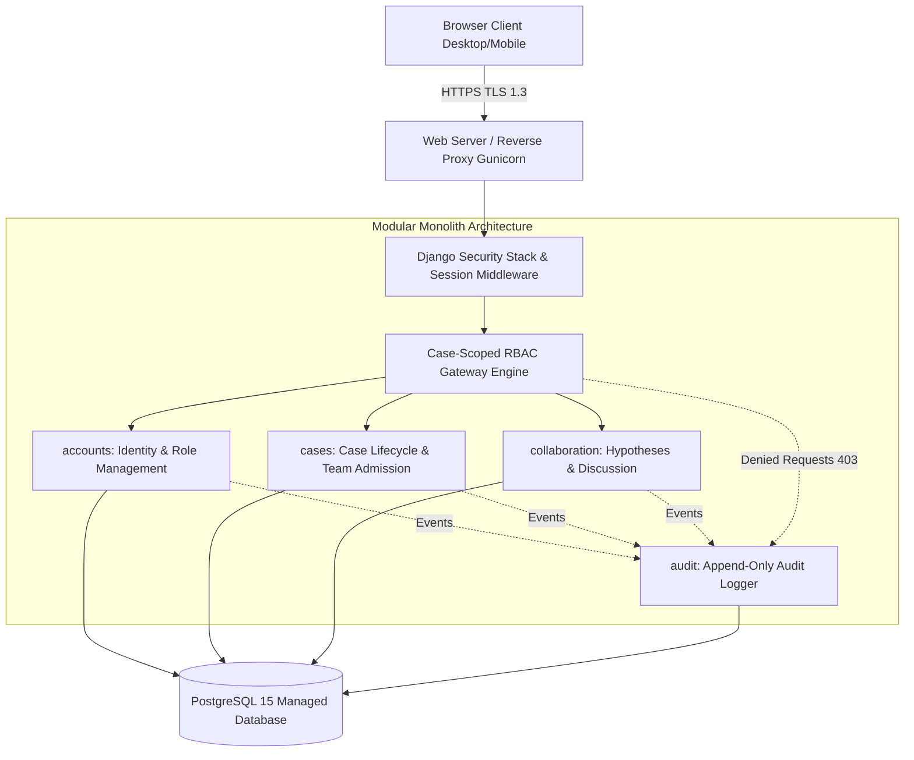
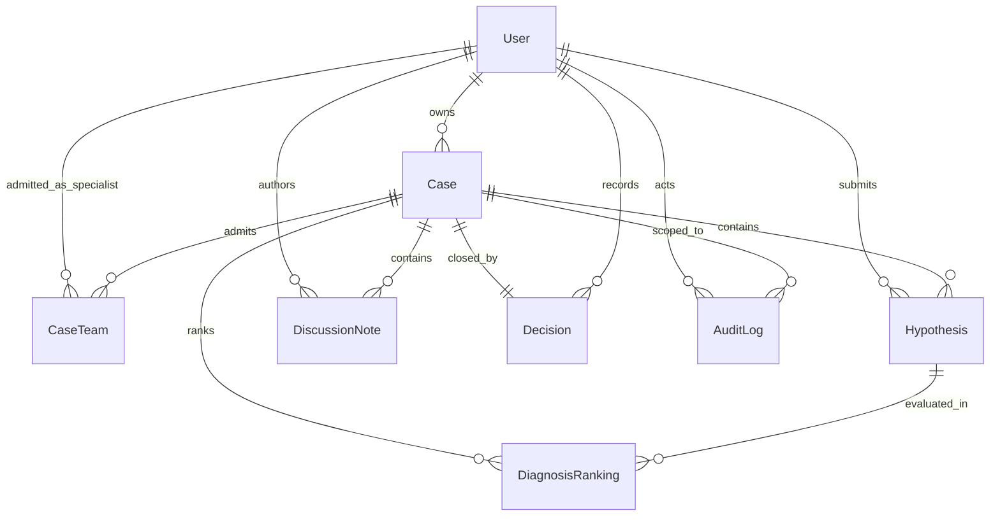
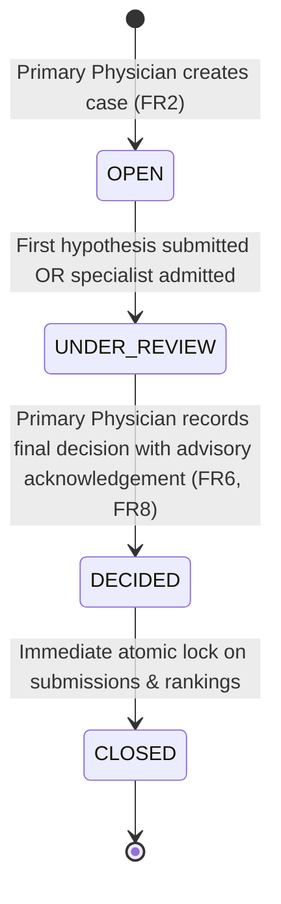
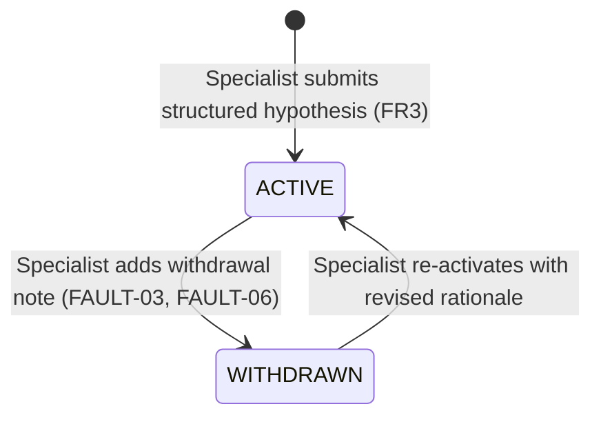

# DOPA — Technical Architecture & System Design Specification

**System:** DOPA (Secure Cloud-Based Platform for Global Specialist Collaboration in Complex Clinical Case Management)  
**Target Stack:** Python 3.11, Django 4.2 LTS, PostgreSQL 15, Django Templates + Tailwind CSS, Gunicorn  
**Architectural Style:** Modular Monolith (4 Cohesive Domain Apps)  
**Security & Governance Target:** Zero-Bypass Case-Scoped RBAC, Singularity-Enforced Decisions, Append-Only Audit Forensics  

---

## 1. Architectural Overview & Component Boundaries

The system is architected as a modular monolith deployed as a single deployable unit to satisfy free-tier resource constraints (512 MB RAM quota on PaaS) while strictly decoupling domain concerns into four Django applications.



### Application Domain Boundaries

1. **`accounts` (Identity & Role Management)**:
   - Manages user identity, registration, PBKDF2 credential hashing, and immutable role binding.
   - Provides authenticated session cookies (`HttpOnly`, `Secure`, `SameSite=Lax`) with a 30-minute idle session timeout.
   - Manages password reset tokens and login rate-limiting.

2. **`cases` (Case Lifecycle & Access Control)**:
   - Manages clinical case entities (`title`, `clinical_summary`, `history`, `findings`, `status`).
   - Manages the `CaseTeam` junction table for specialist admission.
   - Coordinates the case lifecycle state machine (`OPEN`, `UNDER_REVIEW`, `DECIDED`, `CLOSED`).
   - Manages the `DifferentialRanking` entity and reordering operations.
   - Enforces the `Decision` entity creation with mandatory governance acknowledgement and database-level singularity.

3. **`collaboration` (Clinical Reasoning & Deliberation)**:
   - Manages structured `Hypothesis` submissions (`proposed_diagnosis`, `rationale`, `supporting_evidence`).
   - Handles hypothesis lifecycle states (`ACTIVE`, `WITHDRAWN`) and follow-up notes.
   - Manages chronological narrative `DiscussionNote` entries with automatic template XSS escaping.

4. **`audit` (Forensic Audit Trail & Governance Forensics)**:
   - Provides a centralized, append-only write pathway for all security and clinical events.
   - Logs both authorized actions and blocked access attempts (`ACCESS_DENIED`).
   - Restricts database privileges such that ordinary application users have zero `UPDATE` or `DELETE` permissions on audit tables.

---

## 2. Relational Data Model (3NF Specification)

All models are normalized to Third Normal Form (3NF) to prevent update anomalies and guarantee audit integrity.



### Detailed Table Schemas

#### 2.1 `accounts_user`
| Column | Type | Constraints | Description |
|---|---|---|---|
| `id` | `UUID` | Primary Key, default `uuid4` | Global identifier |
| `email` | `VARCHAR(254)` | Unique, Indexed, Not Null | Clinician email (login identifier) |
| `full_name` | `VARCHAR(150)` | Not Null | Professional full name |
| `role` | `VARCHAR(20)` | Not Null, Check in (`PRIMARY_PHYSICIAN`, `SPECIALIST`) | Immutable clinical role |
| `password` | `VARCHAR(128)` | Not Null | PBKDF2-SHA256 salted hash |
| `is_active` | `BOOLEAN` | Default `True`, Not Null | Account active status |
| `created_at` | `TIMESTAMPTZ` | Default `NOW()`, Not Null | Registration timestamp |

#### 2.2 `cases_case`
| Column | Type | Constraints | Description |
|---|---|---|---|
| `id` | `UUID` | Primary Key, default `uuid4` | Case identifier |
| `owner_id` | `UUID` | FK $\rightarrow$ `accounts_user(id)`, Not Null | Primary Physician case owner |
| `title` | `VARCHAR(200)` | Not Null | Case title / presenting complaint |
| `clinical_summary` | `TEXT` | Not Null | High-level clinical presentation |
| `history` | `TEXT` | Not Null | Past medical, family, social history |
| `findings` | `TEXT` | Not Null | Structured vitals, lab markers, imaging (max 5,000 chars) |
| `status` | `VARCHAR(20)` | Not Null, Default `'OPEN'`, Check in (`OPEN`, `UNDER_REVIEW`, `DECIDED`, `CLOSED`) | Case lifecycle status |
| `created_at` | `TIMESTAMPTZ` | Default `NOW()`, Not Null | Creation timestamp |
| `updated_at` | `TIMESTAMPTZ` | Auto-update on save | Last modification timestamp |

#### 2.3 `cases_caseteam`
| Column | Type | Constraints | Description |
|---|---|---|---|
| `case_id` | `UUID` | FK $\rightarrow$ `cases_case(id)` ON DELETE CASCADE | Case reference |
| `specialist_id` | `UUID` | FK $\rightarrow$ `accounts_user(id)` ON DELETE CASCADE | Admitted Specialist |
| `admitted_by_id` | `UUID` | FK $\rightarrow$ `accounts_user(id)` | Case owner who admitted specialist |
| `admitted_at` | `TIMESTAMPTZ` | Default `NOW()`, Not Null | Admission timestamp |
| **Composite PK** | `(case_id, specialist_id)` | Primary Key | Prevents duplicate team entries |

#### 2.4 `collaboration_hypothesis`
| Column | Type | Constraints | Description |
|---|---|---|---|
| `id` | `UUID` | Primary Key, default `uuid4` | Hypothesis identifier |
| `case_id` | `UUID` | FK $\rightarrow$ `cases_case(id)` ON DELETE CASCADE | Target case |
| `specialist_id` | `UUID` | FK $\rightarrow$ `accounts_user(id)` ON DELETE PROTECT | Submitting specialist |
| `proposed_diagnosis`| `VARCHAR(250)`| Not Null | Diagnostic label |
| `rationale` | `TEXT` | Not Null (min 20 chars, max 3,000 chars) | Pathophysiological reasoning |
| `supporting_evidence`| `TEXT` | Not Null (min 20 chars, max 3,000 chars) | References to case data/findings |
| `status` | `VARCHAR(20)` | Not Null, Default `'ACTIVE'`, Check in (`ACTIVE`, `WITHDRAWN`) | Lifecycle status |
| `submitted_at` | `TIMESTAMPTZ` | Default `NOW()`, Not Null | Submission timestamp |

#### 2.5 `collaboration_discussionnote`
| Column | Type | Constraints | Description |
|---|---|---|---|
| `id` | `UUID` | Primary Key, default `uuid4` | Note identifier |
| `case_id` | `UUID` | FK $\rightarrow$ `cases_case(id)` ON DELETE CASCADE | Target case |
| `author_id` | `UUID` | FK $\rightarrow$ `accounts_user(id)` ON DELETE PROTECT | Note author (Physician or Specialist)|
| `body` | `TEXT` | Not Null (max 2,000 chars) | Narrative clinical comment |
| `posted_at` | `TIMESTAMPTZ` | Default `NOW()`, Not Null | UTC posting timestamp |

#### 2.6 `cases_diagnosisranking`
| Column | Type | Constraints | Description |
|---|---|---|---|
| `id` | `UUID` | Primary Key, default `uuid4` | Ranking identifier |
| `case_id` | `UUID` | FK $\rightarrow$ `cases_case(id)` ON DELETE CASCADE | Target case |
| `hypothesis_id` | `UUID` | FK $\rightarrow$ `collaboration_hypothesis(id)` ON DELETE CASCADE | Ranked hypothesis |
| `rank_position` | `INTEGER` | Not Null, Check (`rank_position > 0`) | Relative rank position (1 = top) |
| `updated_at` | `TIMESTAMPTZ` | Default `NOW()`, Not Null | Timestamp of ranking change |
| **Unique 1** | `(case_id, hypothesis_id)` | Unique Constraint | Exactly one rank per hypothesis |
| **Unique 2** | `(case_id, rank_position)` | Unique Constraint | No two hypotheses share a rank |

#### 2.7 `cases_decision`
| Column | Type | Constraints | Description |
|---|---|---|---|
| `id` | `UUID` | Primary Key, default `uuid4` | Decision identifier |
| `case_id` | `UUID` | FK $\rightarrow$ `cases_case(id)`, **UNIQUE** | Target case (Enforces 1 decision per case) |
| `decider_id` | `UUID` | FK $\rightarrow$ `accounts_user(id)` | Attributed Case Owner |
| `final_diagnosis` | `VARCHAR(250)` | Not Null | Definitive clinical diagnosis |
| `advisory_acknowledged` | `BOOLEAN` | Not Null, Must be `True` | Legal advisory acknowledgement |
| `governance_statement`| `TEXT` | Not Null | Rendered text of governance modal |
| `recorded_at` | `TIMESTAMPTZ` | Default `NOW()`, Not Null | Decision timestamp |

#### 2.8 `audit_auditlog`
| Column | Type | Constraints | Description |
|---|---|---|---|
| `id` | `UUID` | Primary Key, default `uuid4` | Log identifier |
| `actor_id` | `UUID` | FK $\rightarrow$ `accounts_user(id)` NULLABLE | Initiator (null if failed login) |
| `action` | `VARCHAR(50)` | Not Null | Event type (see Audit Taxonomy) |
| `entity_type` | `VARCHAR(50)` | Not Null | Target table/entity (`Case`, etc.) |
| `entity_id` | `VARCHAR(100)` | Not Null | PK of target entity |
| `case_id` | `UUID` | FK $\rightarrow$ `cases_case(id)` NULLABLE | Context case if applicable |
| `ip_address` | `INET` / `VARCHAR(45)` | Not Null | Originating IP address |
| `status` | `VARCHAR(20)` | Not Null, Check in (`ALLOWED`, `DENIED`)| Outcome of security check |
| `details` | `JSONB` / `TEXT` | Nullable | Context payload / reason |
| `timestamp` | `TIMESTAMPTZ` | Default `NOW()`, Not Null | Server-side immutable UTC time |

---

## 3. Case-Scoped RBAC Gateway Engine

The RBAC engine mediates all access to clinical resources. Rather than relying solely on global roles, it evaluates an authorization tuple on every request:
$$\text{AuthTuple} = (\text{Actor Role}, \text{Case Relationship}, \text{Case Lifecycle Status})$$

### 3.1 Permission Matrix

| Capability | Allowed Global Role | Required Case Relationship | Permitted Case Statuses | Denial HTTP Code |
|---|---|---|---|---|
| **Case Creation** | `PRIMARY_PHYSICIAN` | Any | N/A (New Entity) | `403 Forbidden` |
| **Team Admission** | `PRIMARY_PHYSICIAN` | `owner_id == actor.id` | `OPEN`, `UNDER_REVIEW` | `403 Forbidden` |
| **Hypothesis Submission** | `SPECIALIST` | `actor.id IN CaseTeam` | `OPEN`, `UNDER_REVIEW` | `403 Forbidden` |
| **Hypothesis Withdrawal** | `SPECIALIST` | `specialist_id == actor.id` | `OPEN`, `UNDER_REVIEW` | `403 Forbidden` |
| **Discussion Post** | Both Roles | Owner OR `actor.id IN CaseTeam` | `OPEN`, `UNDER_REVIEW` | `403 Forbidden` |
| **Ranking Update** | `PRIMARY_PHYSICIAN` | `owner_id == actor.id` | `OPEN`, `UNDER_REVIEW` | `403 Forbidden` |
| **Final Decision Record** | `PRIMARY_PHYSICIAN` | `owner_id == actor.id` | `OPEN`, `UNDER_REVIEW` | `403 Forbidden` |
| **View Case Workspace** | Both Roles | Owner OR `actor.id IN CaseTeam` | `OPEN`, `UNDER_REVIEW`, `DECIDED`, `CLOSED` | `403 Forbidden` |
| **View Audit Trail** | Both Roles | Owner OR `actor.id IN CaseTeam` | Any | `403 Forbidden` |

### 3.2 Enforcement Architecture & Denial Logging

Authorization checks are implemented via server-side Python decorators and mixins (`@case_access_required`, `@case_owner_required`, `@specialist_team_required`).

If any condition fails:
1. An `AuditLog` entry is immediately dispatched with `status="DENIED"` and `action="ACCESS_DENIED"`.
2. The request is aborted with an `HTTP 403 Forbidden` response.
3. No business logic or clinical view handler is executed.

---

## 4. Lifecycle State Machines

### 4.1 Case Lifecycle State Machine



- **`OPEN`**: Case record created. Team admission active.
- **`UNDER_REVIEW`**: Active collaborative reasoning. Hypotheses, discussion, and ranking updates permitted.
- **`DECIDED`**: Final clinical decision recorded with mandatory checkbox acknowledgement.
- **`CLOSED`**: All modifications locked. Hypotheses, discussions, rankings, and case data become permanently read-only.

### 4.2 Hypothesis Lifecycle State Machine



- **`ACTIVE`**: Included in the differential ranking list and visible in the workspace center pane.
- **`WITHDRAWN`**: Demoted/excluded from active differential ranking calculations, but permanently preserved in the discussion thread and hypothesis history with a prominent `[WITHDRAWN]` badge to preserve complete clinical provenance.

---

## 5. Resolution of Gaps, Faults & Contradictions

| Analysis ID | Nature | Root Cause | Architectural Resolution |
|---|---|---|---|
| **FAULT-01** | Fault | `findings` field schema undefined | Implemented as a validated text block with distinct markdown subsections (`### Vital Signs`, `### Laboratory Markers`, `### Imaging & Diagnostics`). Server-validated with max length 5,000 characters. |
| **FAULT-02** | Fault | "Authorized participants" ambiguity | Formalized in the Case-Scoped RBAC Permission Matrix (§3.1): Primary Physician owns case; Specialists must hold an explicit `CaseTeam` membership. |
| **FAULT-03 / FAULT-06** | Fault | Hypothesis withdrawal mechanics undefined | `Hypothesis.status` field (`ACTIVE`, `WITHDRAWN`). Withdrawn hypotheses cannot be ranked but remain visible with full timestamp and rationale to preserve reasoning provenance. |
| **FAULT-04 / FAULT-05** | Fault | Case lifecycle transitions unspecified | Formally defined in §4.1 state machine with explicit automated transitions. |
| **FAULT-07 / GAP-05** | Gap | No notifications or alerts | Implemented `accounts_notification` model with in-app notification badges for team admission, new hypotheses, and case closure. |
| **GAP-03** | Gap | Missing session idle timeout | Enforced via Django session middleware: `SESSION_COOKIE_AGE = 1800` (30 mins), `SESSION_SAVE_EVERY_REQUEST = True` (rolling window), `SESSION_EXPIRE_AT_BROWSER_CLOSE = True`. |
| **GAP-06** | Gap | No password recovery flow | Integrated Django standard cryptographic token-based password reset workflow (`django.contrib.auth.views.PasswordResetView`). |
| **GAP-07** | Gap | Dashboard search and filtering missing | Implemented server-side status filters (`status=OPEN,UNDER_REVIEW,DECIDED,CLOSED`) and PostgreSQL text search on case title and summary. |
| **US-SY-04** | Gap | Idempotency on unreliable 3G networks | Synchronizer token pattern (`idempotency_token` UUID submitted via hidden form fields and validated in cache/session) preventing double submissions. |

---

## 6. Clinical Workspace 3-Pane Interface Layout

The single-page 3-pane clinical workspace satisfies **NFR7** and prevents cognitive fragmentation:

```
+----------------------------------------------------------------------------------------------------+
| DOPA Platform Header: [Case Title] | Status: [UNDER_REVIEW] | Owner: Dr. [Name] | [Audit Trail Link] |
+------------------------------------+-----------------------------------+---------------------------+
| LEFT PANE (30% Width)              | CENTER PANE (40% Width)           | RIGHT PANE (30% Width)    |
| Case Presentation & Discussion     | Structured Hypothesis Formulation | Differential Diagnosis    |
+------------------------------------+-----------------------------------+---------------------------+
| [Clinical Summary & Findings]      | [Structured Submission Form]      | [Ranked Differential Deck]|
| - Patient History                  | - Proposed Diagnosis (Input)      | #1: Diagnosis A           |
| - Vitals & Laboratory Findings     | - Clinical Rationale (Textarea)   |     (Move Down)           |
| - Expandable full history          | - Supporting Evidence (Textarea)  | #2: Diagnosis B           |
|                                    |   [Submit Hypothesis Button]      |     (Move Up / Move Down) |
| [Chronological Discussion Feed]    |                                   | #3: Diagnosis C           |
| - Note by Dr. A (Specialist)       | [Active Hypotheses Cards Deck]    |     (Move Up)             |
| - Note by Dr. B (Primary Phys)     | - Card 1: Diagnosis A [ACTIVE]    |                           |
|                                    | - Card 2: Diagnosis B [ACTIVE]    | [Specialist View:         |
| [Post Narrative Note Form]         | - Card 3: Diagnosis C [WITHDRAWN] |  Read-Only Order]         |
| - Text input + Post CTA            |                                   |                           |
|                                    |                                   | [RECORD FINAL DECISION]   |
|                                    |                                   | (Case Owner Only Modal)   |
+------------------------------------+-----------------------------------+---------------------------+
```

### Low-Bandwidth & Query Optimization (NFR4, NFR5)
- All workspace data is loaded in **a single Django view** using `select_related('owner')` and `prefetch_related('caseteam_set__specialist', 'hypothesis_set', 'discussionnote_set__author', 'diagnosisranking_set__hypothesis')`.
- Total database roundtrips per workspace render is strictly bounded to **$\le 4$ SQL queries**.
- No heavy frontend JavaScript runtime; interactions rely on clean semantic HTML forms and lightweight progressive DOM enhancements, ensuring $< 1.0\text{ s}$ warm load times and resilience on throttled 3G connections.
